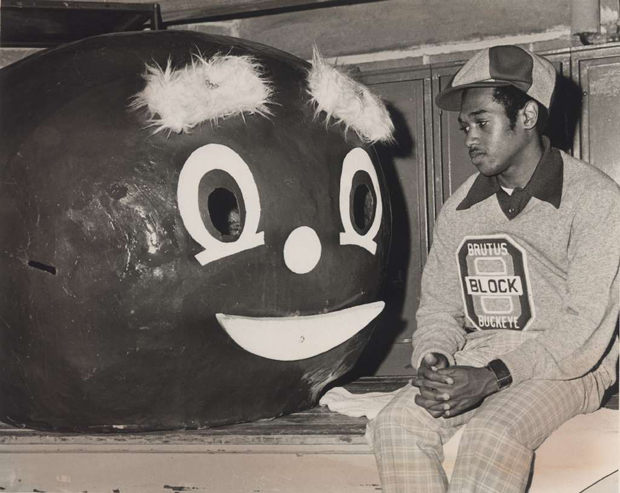

College Football Poll Data
==========================

This is a simple script that scrapes the AP College Football Poll (both the consensus and the voter-level data) and the Coaches Poll. The script uses the `rvest`, `stringr`, and `knitr` packages. The `knitr` package is optional since I'll sometimes generate an HTML table to use elsewhere.

